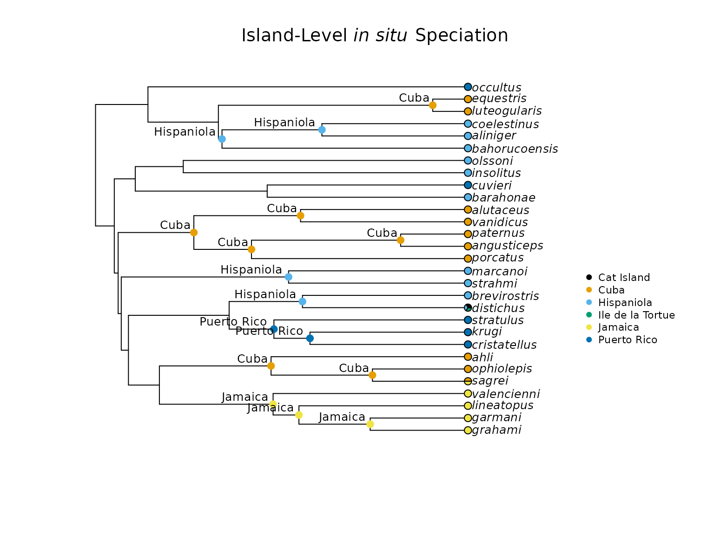
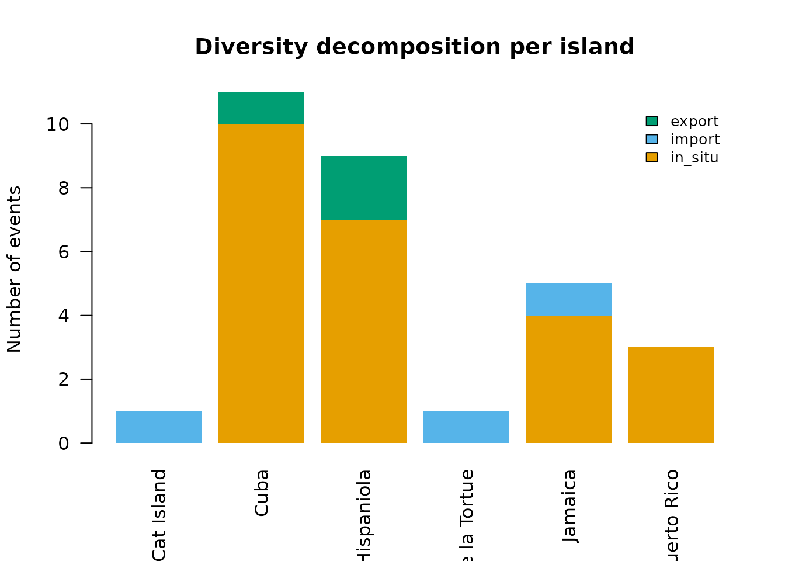
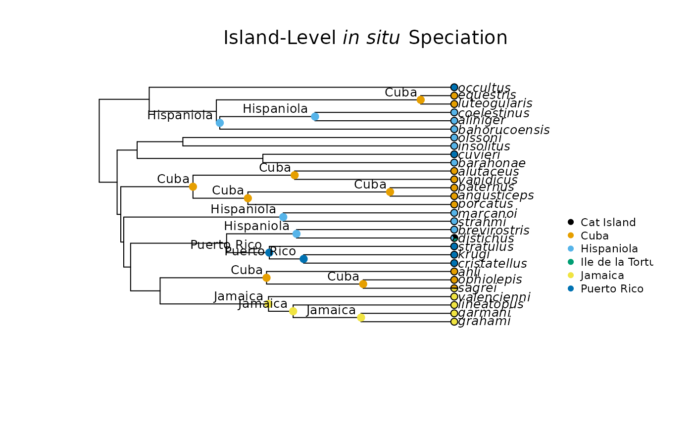

# Getting Started with insitu

## Introduction

Extant biodiversity and species distribution across the globe result
from the interplay of three fundamental processes: speciation,
extinction, and dispersal. Evolutionary biologists often work to
disentangle the contributions of each of these processes to the
diversity we observe today. Furthermore, associating these processes
with the geography on which they occur provides researchers with a
clearer picture of how extant biodiversity emerged.

We can associate speciation with geography by considering *in situ*
speciation events. A speciation event is considered to be *in situ* when
it occurs within a specific geographical range, as opposed to a lineage
colonizing a location from elsewhere. The importance of *in situ*
speciation for understanding diversity patterns has been emphasized by
decades of work, much of which discusses how *in situ* speciation
contributes to species richness on islands.

The `insitu` R package provides a suite of functions that allows the
user to estimate *in situ* speciation events and quantify their
contribution to biodiversity in discrete geographical units, with a
primary focus on island systems and island-like environments. This
vignette will cover the functions from the `insitu` package that are
necessary to perform a basic analysis that classifies nodes on a
phylogeny as *in situ* speciation, colonization, or dispersal events, as
well as computing diversity decomposition metrics and visualizing
results.

This vignette will walk through the following steps in the `insitu`
pipeline:

- Data Preparation
- Classifying Events and Diversity Decomposition
- Rates, Indices, and Support
- Adaptive Radiation Bursts

## Data Preparation

For its most basic functions, the `insitu` package requires the user to
input a phylogeny and a list of locations that each species of interest
occupies. The phylogenetic tree should be ultrametric and include all
species listed in the location data, but if there are any mismatches in
these datasets, the
[`insitu::prep_phylo()`](https://datadiversitylab.github.io/insitu/reference/prep_phylo.md)
and
[`insitu::match_island_phylo()`](https://datadiversitylab.github.io/insitu/reference/match_island_phylo.md)
functions will address them. The example data here includes 30
island-dwelling *Anolis* lizard species sampled from the phylogenetic
tree of all *Anolis* species included in Patton et al. (2021).

``` r

# Load insitu library
library(insitu)

# Read in example tree
tree <- ape::read.tree(system.file("extdata/Patton_etal_trimmed.tree",
                                       package = "insitu"))

# Handle non-ultrametricity and incomplete taxon sampling
tree <- prep_phylo(tree)

# Read in example dataset
dat <- read.csv(system.file("extdata/anolis_dat.csv",
                            package = "insitu"))

# Ensure that species represented in both the tree and data are the same
matched <- match_island_phylo(phy = tree, locs = dat)
#> ℹ Species dropped from the tree because they were not in the data: transversalis and heterodermus
#> ℹ Species dropped from the data because they were not in the tree: loysiana
#> ℹ Matching complete! Here are the first 5 locales in your data:
#> # A tibble: 5 × 3
#>   locale           species_list                                         richness
#>   <chr>            <chr>                                                   <int>
#> 1 Cat Island       distichus                                                   1
#> 2 Cuba             luteogularis, equestris, alutaceus, vanidicus, porc…       10
#> 3 Hispaniola       coelestinus, aliniger, bahorucoensis, olssoni, inso…       10
#> 4 Ile de la Tortue distichus                                                   1
#> 5 Jamaica          valencienni, lineatopus, garmani, grahami, sagrei           5
```

The
[`insitu::match_island_phylo()`](https://datadiversitylab.github.io/insitu/reference/match_island_phylo.md)
function removes species that are not included in both the tree and the
data, and it prints out the names of species removed from each. It also
prints out the first five locations in the dataset as a way for users to
determine whether the correct locations will be included in downstream
analyses. The `matched` object is a list of three items: a
presence-absence matrix (PAM) that summarizes the islands each species
occupies (1 for presence and 0 for absence), a tibble that lists each
island and all species that are present on each island, and a
phylogenetic tree with tips matching those in the user-provided dataset.

## Classifying Events and Diversity Decomposition

The `insitu` package provides multiple functions for estimating
ancestral character states and classifying nodes on a phylogeny as *in
situ* speciation, colonization, or dispersal events. First, we will
estimate ancestral character states via ancestral state reconstruction
(ASR). Then, we will classify each node as an appropriate event based on
the estimated history of that node. Next, we will estimate and visualize
diversity decomposition at each node. Finally, we will cover methodology
for classifying events without ancestral state reconstruction.

### Geography-Based Ancestral State Reconstruction

The first method for estimating ancestral states uses the PAM included
in the `matched` object created above to identify extant geographical
character states for each species. Then, ancestral character states are
estimated across the provided phylogeny for each island in the dataset.

``` r

# Use the tree and PAM from the "matched" object to run an ancestral state reconstruction
asr_insitu <- run_geo_asr(phy = matched$phy, PAM = matched$PAM)
```

The `asr_insitu` object is a list of `ace` objects describing the ASR
relevant to each island in the dataset. The number of elements in the
list resulting from
[`insitu::run_geo_asr()`](https://datadiversitylab.github.io/insitu/reference/run_geo_asr.md)
depends on the number of islands. In this case, there are six elements
in the `asr_insitu` list.

The `insitu` package also provides functionality for using stochastic
character mapping to estimate ancestral states. The workflow for this
methodology is outlined in the
`Stochastic Character Mapping With insitu` vignette. At the end of the
`Classifying Events and Diversity Decomposition` section, we also cover
methods for classifying nodes that do not require ancestral state
reconstruction.

### Classify Speciation Events

Now that we have estimated ancestral character states, we can use them
to determine whether speciation events occurred *in situ* (within a
given island) by determining whether the most recent common ancestor
between two tips is likely to have occurred on the same island as the
descendants. For this task, we will use the
[`insitu::map_insitu_events()`](https://datadiversitylab.github.io/insitu/reference/map_insitu_events.md)
function. This function requires the user to input the ancestral state
reconstructions returned by
[`insitu::run_geo_asr()`](https://datadiversitylab.github.io/insitu/reference/run_geo_asr.md),
the matched phylogeny and PAM returned by
[`insitu::match_island_phylo()`](https://datadiversitylab.github.io/insitu/reference/match_island_phylo.md),
and a threshold probability for determining whether *in situ* speciation
is evident. The default threshold probability is 0.5, meaning that if
the probability that an ancestor occupied a given island is 0.5 or
greater, and the descendants of that node also have the same island
state, the
[`insitu::match_island_phylo()`](https://datadiversitylab.github.io/insitu/reference/match_island_phylo.md)
function will determine that an *in situ* speciation event occurred.

``` r

# Using the ASR from above, determine whether speciation events occurred in situ
map_events <- map_insitu_events(recons = asr_insitu,
                                phy = matched$phy,
                                PAM = matched$PAM,
                                threshold = 0.5)

# Look at the first 5 entries in the event data frame
head(map_events, n = 5)
#>   node     island ancestor_presence_prob in_situ export import
#> 1   32       Cuba           0.0004768696   FALSE   <NA>   <NA>
#> 2   33 Hispaniola           0.1330833336   FALSE   <NA>   <NA>
#> 3   35    Jamaica           0.0267314591   FALSE   <NA>   <NA>
#> 4   36    Jamaica           0.9837431335    TRUE   <NA>   <NA>
#> 5   37    Jamaica           0.9977352874    TRUE   <NA>   <NA>
```

The resulting data frame includes: the node number, the island state,
the probability that the ancestor of a given node shares the same island
state, and whether this node represents an *in situ* speciation event.
The bottom of the data frame includes information on estimated
transitions between islands, their associated nodes, and the islands
associated with the transition. An island in the “export” column were
originally occupied by the species that now occupy the island in the
“import” column.

### Visualize *in situ* Speciation Events on the Phylogeny

We can visualize the probabilities and classifications provided by the
[`insitu::map_insitu_events()`](https://datadiversitylab.github.io/insitu/reference/map_insitu_events.md)
function on the *Anolis* phylogeny using the
[`insitu::plot_classified_phylo()`](https://datadiversitylab.github.io/insitu/reference/plot_classified_phylo.md)
function. When the ancestor presence probability has reached or exceeded
the treshold (0.5 in this case), a colored dot will be placed on the
associated node that corresponds to the island on which the *in situ*
speciation event occurred.

``` r


plot_classified_phylo(phy = matched$phy, events = map_events, PAM = matched$PAM)
```



This annotated phylogeny helps visualize how these *Anolis* species
diversified across Cuba, Hispaniola, Jamaica, and Puerto Rico.

### Partition Species Richness Into Different Components (in situ speciation, import, and export events)

When speciation events were classified above using the
[`insitu::map_insitu_events()`](https://datadiversitylab.github.io/insitu/reference/map_insitu_events.md)
function, we acknowledged, but did not work with, the number of import
and export events. The following functions address all of the different
events discussed so far and summarize their relative importance to the
system of interest.

First, we will use the
[`insitu::decompose_diversity()`](https://datadiversitylab.github.io/insitu/reference/decompose_diversity.md)
function with the phylogeny and PAM returned from the
[`insitu::match_island_phylo()`](https://datadiversitylab.github.io/insitu/reference/match_island_phylo.md)
function, along with the events returned from the
[`insitu::map_insitu_events()`](https://datadiversitylab.github.io/insitu/reference/map_insitu_events.md)
function to determine the number of species, *in situ* speciation
events, import events, and export events associated with each island.

``` r

div <- decompose_diversity(phy = matched$phy,
                           events = map_events,
                           PAM = matched$PAM)

# Look at the first 5 rows of the classification data frame
head(div, n = 5)
#>             island n_species n_insitu n_import n_export prop_insitu
#> 1       Cat Island         1        0        1        0         0.0
#> 2             Cuba        10       10        0        1         1.0
#> 3       Hispaniola        10        7        0        2         0.7
#> 4 Ile de la Tortue         1        0        1        0         0.0
#> 5          Jamaica         5        4        1        0         0.8
```

The results of the
[`insitu::decompose_diversity()`](https://datadiversitylab.github.io/insitu/reference/decompose_diversity.md)
function give us a clearer picture of how species richness accumulated
on each function. This diversity decomposition can be further visualized
using the
[`insitu::plot_diversity_decomposition()`](https://datadiversitylab.github.io/insitu/reference/plot_diversity_decomposition.md)
function.

``` r

# Visualize diversity decomposition per island in a stacked bar chart
plot_diversity_decomposition(div)
```



The stacked bar plot above accentuates the importance of *in situ*
speciation in contributing to species richness for Cuba, Hispaniola,
Jamaica, and Puerto Rico, while also highlighting import and export
events. We can compare these events statistically through the use of the
[`insitu::compare_islands()`](https://datadiversitylab.github.io/insitu/reference/compare_islands.md)
function, which runs chi-squared and Kruskal-Wallis tests to determine
whether event counts, *in situ* rates, and colonization rates differ
across islands.

``` r

# Determine whether:
# - In situ speciation, import, and export counts differ across islands
# - In situ and colonization rates differ across islands
comp_div <- compare_islands(div)
```

The `comp_div` object created using the
[`insitu::compare_islands()`](https://datadiversitylab.github.io/insitu/reference/compare_islands.md)
function is a list of three elements: `counts_test`, `insitu_rate_test`,
and `colonization_rate_test`. Each one contains the summary output for
each test: - `counts_test` is a chi-squared test that determines whether
*in situ* speciation, import, and export counts differ across islands. -
`insitu_rate_test` is a Kruskal-Wallis test that determines whether *in
situ* speciation rates differ across islands. - `colonization_rate_test`
is a Kruskal-Wallis test that determines whether colonization rates
differ across islands.

The results for this example are printed below:

``` r

comp_div
#> $counts_test
#> 
#>  Pearson's Chi-squared test
#> 
#> data:  counts_mat
#> X-squared = 23.273, df = 10, p-value = 0.009783
#> 
#> 
#> $insitu_rate_test
#> 
#>  Kruskal-Wallis rank sum test
#> 
#> data:  insitu_rate by div$island
#> Kruskal-Wallis chi-squared = 5, df = 5, p-value = 0.4159
#> 
#> 
#> $colonization_rate_test
#> 
#>  Kruskal-Wallis rank sum test
#> 
#> data:  colonization_rate by div$island
#> Kruskal-Wallis chi-squared = 5, df = 5, p-value = 0.4159
```

The p-values for each test indicate that the event counts in general
differ between islands, but the *in situ* speciation and colonization
rates are not statistically significantly different between islands.

## Rates, Indices, and Support

Up to this point, we have focused on event classification and
visualization. In this section, we will cover functionality in the
`insitu` package that allows for the calculation of helpful rates and
indices that further contextualize the emergence of biodiversity on the
islands of interest.

### Determine Colonization Rates

Species richness results from the interplay of speciation, extinction,
and dispersal. Determining the rate at which lineages colonize islands
helps provide a clearer picture of the drivers of species richness. The
[`insitu::colonization_rate()`](https://datadiversitylab.github.io/insitu/reference/colonization_rate.md)
function determines how many colonization events each species is
associated with and provides a colonization rate associated with that
species’ lineage.

``` r

# Colonization rate (how many times each species has colonized an island)
colonization_rate(phy = matched$phy, events = map_events)
#>          species n_import n_export n_colonization colonization_rate
#> 1        grahami        0        0              0        0.00000000
#> 2        garmani        0        0              0        0.00000000
#> 3     lineatopus        0        0              0        0.00000000
#> 4    valencienni        0        0              0        0.00000000
#> 5         sagrei        1        1              1        0.02138029
#> 6     ophiolepis        0        0              0        0.00000000
#> 7           ahli        0        0              0        0.00000000
#> 8   cristatellus        0        0              0        0.00000000
#> 9          krugi        0        0              0        0.00000000
#> 10     stratulus        0        0              0        0.00000000
#> 11     distichus        1        1              1        0.02138029
#> 12  brevirostris        0        0              0        0.00000000
#> 13       strahmi        0        0              0        0.00000000
#> 14      marcanoi        0        0              0        0.00000000
#> 15      porcatus        0        0              0        0.00000000
#> 16   angusticeps        0        0              0        0.00000000
#> 17      paternus        0        0              0        0.00000000
#> 18     vanidicus        0        0              0        0.00000000
#> 19     alutaceus        0        0              0        0.00000000
#> 20     barahonae        0        0              0        0.00000000
#> 21       cuvieri        0        0              0        0.00000000
#> 22     insolitus        0        0              0        0.00000000
#> 23       olssoni        0        0              0        0.00000000
#> 24 bahorucoensis        0        0              0        0.00000000
#> 25      aliniger        0        0              0        0.00000000
#> 26   coelestinus        0        0              0        0.00000000
#> 27  luteogularis        0        0              0        0.00000000
#> 28     equestris        0        0              0        0.00000000
#> 29      occultus        0        0              0        0.00000000
```

Here, we can see that only *Anolis sagrei* and *Anolis distichus* were
involved in colonization events.

### Calculate the *in situ* Speciation Index

In an effort to standardize comparisons across islands to determine the
relative importance of *in situ* speciation events in contributing to
species richness, the `insitu` package includes a function to calculate
the `isci` index. This index represents the number of *in situ*
speciation events on an island divided by the total branch length of the
island’s subtree.

``` r

# Per-island in situ speciation index
insitu_speciation_index(phy = matched$phy, events = map_events)
#>        island n_insitu island_bl       isci
#> 1        Cuba        7 103.02752 0.06794301
#> 2  Hispaniola        4  52.27162 0.07652336
#> 3     Jamaica        3  30.36114 0.09881053
#> 4 Puerto Rico        2  10.15259 0.19699404
```

In this example, Puerto Rico has the largest `isci` value, indicating
that *in situ* speciation contributed more species over a shorter amount
of evolutionary time compared to the other islands.

### Determine Node Support

The
[`insitu::map_insitu_events()`](https://datadiversitylab.github.io/insitu/reference/map_insitu_events.md)
function returns probabilities for the most likely ancestral states
among all islands for each node. If the user would like to conduct
additional sensitivity analyses related to these ancestral state
probabilities, the `insitu` package provides a function that displays
the ancestral state probabilities for each island and node combination.
It also determines whether the given probability corresponds with low
(probability less than 0.5), moderate (probability between 0.5 and
0.75), or high (probability above 0.75) support.

``` r

# Determine per-node support for in situ speciation events
insitu_conf <- insitu_confidence(recons = asr_insitu)

head(insitu_conf, n = 30)
#>     node     island         prob support
#> 30    30 Cat Island 2.544387e-05     low
#> 31    31 Cat Island 2.446989e-08     low
#> 32    32 Cat Island 3.966199e-09     low
#> 33    33 Cat Island 1.630836e-08     low
#> 34    34 Cat Island 1.326783e-07     low
#> 35    35 Cat Island 1.543357e-06     low
#> 36    36 Cat Island 2.329244e-06     low
#> 37    37 Cat Island 1.358496e-06     low
#> 38    38 Cat Island 2.596481e-06     low
#> 39    39 Cat Island 8.563237e-06     low
#> 40    40 Cat Island 3.607820e-06     low
#> 41    41 Cat Island 1.122414e-04     low
#> 42    42 Cat Island 4.251625e-06     low
#> 43    43 Cat Island 3.806389e-06     low
#> 44    44 Cat Island 1.139486e-02     low
#> 45    45 Cat Island 2.029607e-05     low
#> 46    46 Cat Island 1.986440e-06     low
#> 47    47 Cat Island 7.205493e-06     low
#> 48    48 Cat Island 2.585020e-06     low
#> 49    49 Cat Island 1.135155e-05     low
#> 50    50 Cat Island 6.639532e-07     low
#> 51    51 Cat Island 2.007101e-05     low
#> 52    52 Cat Island 1.478841e-05     low
#> 53    53 Cat Island 6.068960e-06     low
#> 54    54 Cat Island 4.519986e-07     low
#> 55    55 Cat Island 5.812977e-07     low
#> 56    56 Cat Island 8.054252e-06     low
#> 57    57 Cat Island 1.002721e-06     low
#> 301   30       Cuba 5.880850e-04     low
#> 311   31       Cuba 1.428336e-04     low
```

### Incorporating Island Ontogeny

Island ontogeny describes the different stages of emergence and
subsistence that oceanic islands experience, and can be thought of as an
island’s “life cycle.” There exists a balance between the age of an
island and it species richness: old, large islands often have more
species compared to young, small islands, but once an island becomes old
enough, it begins to lose area and habitat as it erodes into the ocean.
Whittaker et al. (2008) incorporated island ontogeny in their General
Dynamic Model of island biogeography, which we suggest users review for
additional context.

The `insitu` R package focuses on metrics that help us understand the
role *in situ* speciation has in contributing to species richness on
island systems. What do we do if an estimated *in situ* speciation event
on an internal node is older than the island itself? By incorporating
the age of islands in the dataset, we are able to determine whether it
is appropriate to mark a node as an *in situ* speciation event on an
island, or if the speciation event is more likely to have occurred on a
continent before the lineage colonized the islands of interest.

Geologists struggle to define exact ages for the Caribbean Islands, so
the island ages written here are either estimates or manufactured ages
that help us emphasize the functionality of the `insitu` R package.
First, we will create a named vector of island ages for the 6 islands
included in our example dataset. Then, we will use this named vector,
along with the `map_events` object created by
[`insitu::map_insitu_events()`](https://datadiversitylab.github.io/insitu/reference/map_insitu_events.md)
above and the matched phylogeny to determine whether the speciation
events identified are realistic depending on the age of the islands

``` r

# Create named numeric vector of island ages
ages <- c(42,
          50,
          25,
          46,
          10,
          15)
island_names <- c("Cuba",
                  "Hispaniola",
                  "Jamaica",
                  "Puerto Rico",
                  "Cat Island",
                  "Ile de la Tortue")
# Assign the names to the numeric vector
names(ages) <- island_names

# Flag in situ speciation events if they are too young
age_correct_events(events = map_events, 
                   phy = matched$phy, 
                   island_ages = ages, 
                   remove_predating = FALSE)
#> 2 node(s) predate their island's formation age and are flagged.
#>    node      island ancestor_presence_prob in_situ     export           import
#> 1    32        Cuba           0.0004768696   FALSE       <NA>             <NA>
#> 2    33  Hispaniola           0.1330833336   FALSE       <NA>             <NA>
#> 3    35     Jamaica           0.0267314591   FALSE       <NA>             <NA>
#> 4    36     Jamaica           0.9837431335    TRUE       <NA>             <NA>
#> 5    37     Jamaica           0.9977352874    TRUE       <NA>             <NA>
#> 6    38     Jamaica           0.9998792396    TRUE       <NA>             <NA>
#> 7    39        Cuba           0.9119735154    TRUE       <NA>             <NA>
#> 8    40        Cuba           0.9958979894    TRUE       <NA>             <NA>
#> 9    42 Puerto Rico           0.9053890758    TRUE       <NA>             <NA>
#> 10   43 Puerto Rico           0.9741656727    TRUE       <NA>             <NA>
#> 11   44  Hispaniola           0.7078835948    TRUE       <NA>             <NA>
#> 12   45  Hispaniola           0.8106870642    TRUE       <NA>             <NA>
#> 13   46        Cuba           0.9407811473    TRUE       <NA>             <NA>
#> 14   47        Cuba           0.9861511839    TRUE       <NA>             <NA>
#> 15   48        Cuba           0.9996846026    TRUE       <NA>             <NA>
#> 16   49        Cuba           0.9924222283    TRUE       <NA>             <NA>
#> 17   50  Hispaniola           0.2592652181   FALSE       <NA>             <NA>
#> 18   52  Hispaniola           0.4863067008   FALSE       <NA>             <NA>
#> 19   55  Hispaniola           0.5155452437    TRUE       <NA>             <NA>
#> 20   56  Hispaniola           0.8830491382    TRUE       <NA>             <NA>
#> 21   57        Cuba           0.9969631141    TRUE       <NA>             <NA>
#> 22    5  TRANSITION                     NA      NA       Cuba          Jamaica
#> 23   11  TRANSITION                     NA      NA Hispaniola       Cat Island
#> 24   11  TRANSITION                     NA      NA Hispaniola Ile de la Tortue
#>        node_age island_age predates_island
#> 1  4.393220e+01         42            TRUE
#> 2  4.354118e+01         50           FALSE
#> 3  3.875137e+01         25            TRUE
#> 4  2.447172e+01         25           FALSE
#> 5  2.122746e+01         25           FALSE
#> 6  1.227807e+01         25           FALSE
#> 7  2.473021e+01         42           FALSE
#> 8  1.199797e+01         42           FALSE
#> 9  2.436864e+01         46           FALSE
#> 10 1.984072e+01         46           FALSE
#> 11 2.078444e+01         50           FALSE
#> 12 2.253088e+01         50           FALSE
#> 13 3.442355e+01         42           FALSE
#> 14 2.718870e+01         42           FALSE
#> 15 8.458005e+00         42           FALSE
#> 16 2.102785e+01         42           FALSE
#> 17 4.178154e+01         50           FALSE
#> 18 3.575623e+01         50           FALSE
#> 19 3.088996e+01         50           FALSE
#> 20 1.834137e+01         50           FALSE
#> 21 4.422603e+00         42           FALSE
#> 22 1.270000e-08         NA           FALSE
#> 23 1.170000e-08         NA           FALSE
#> 24 1.170000e-08         NA           FALSE
```

Here, we find that two *in situ* speciation events predate the islands
on which they are estimated to occur: node 32 associated with Cuba, and
node 35 associated with Jamaica. If we set the `remove_predating`
parameter to `TRUE`, the function will remove these events and the
returned data frame can be used to plot *in situ* speciation events on
the phylogeny as above.

``` r

# Remove in situ speciation events if they are too young
new_events <- age_correct_events(events = map_events, 
                                 phy = matched$phy, 
                                 island_ages = ages, 
                                 remove_predating = TRUE)
#> 2 node(s) predate their island's formation age and have been removed.

# Plot phylogeny with newly filtered events
plot_classified_phylo(phy = matched$phy, events = new_events, PAM = matched$PAM)
```



We can also incorporate island age into the calculation of `isci`, the
*in situ* speciation rate index. The
[`insitu::insitu_rate_by_island_age()`](https://datadiversitylab.github.io/insitu/reference/insitu_rate_by_island_age.md)
function uses the phylogeny, event object created by
[`insitu::age_correct_events()`](https://datadiversitylab.github.io/insitu/reference/age_correct_events.md),
and the named numeric vector of island ages created above to calculate
the corrected `isci` value for each island.

``` r

insitu_rate_by_island_age(phy = matched$phy, events = new_events, island_ages = ages)
#>                            island n_insitu island_age insitu_rate_corrected
#> Cuba                         Cuba        7         42            0.16666667
#> Hispaniola             Hispaniola        4         50            0.08000000
#> Jamaica                   Jamaica        3         25            0.12000000
#> Puerto Rico           Puerto Rico        2         46            0.04347826
#> Cat Island             Cat Island        0         10            0.00000000
#> Ile de la Tortue Ile de la Tortue        0         15            0.00000000
```

## Literature Cited

- Patton, A. H., Harmon, L. J., del Rosario Castañeda, M., Frank, H. K.,
  Donihue, C. M., Herrel, A., & Losos, J. B. (2021). When adaptive
  radiations collide: Different evolutionary trajectories between and
  within island and mainland lizard clades. Proceedings of the National
  Academy of Sciences, 118(42), e2024451118
- Whittaker, R. J., Triantis, K. A., & Ladie, R. J. (2008). A general
  dynamic theory of oceanic island biogeography. Journal of
  Biogeography, 35(6), 977–994.
