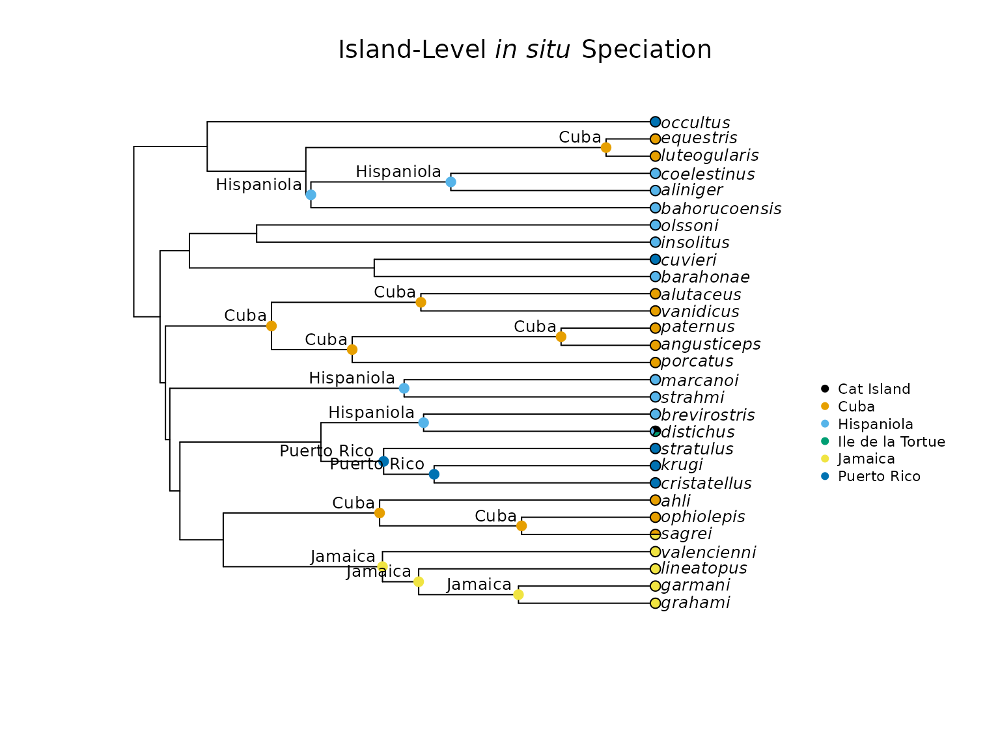
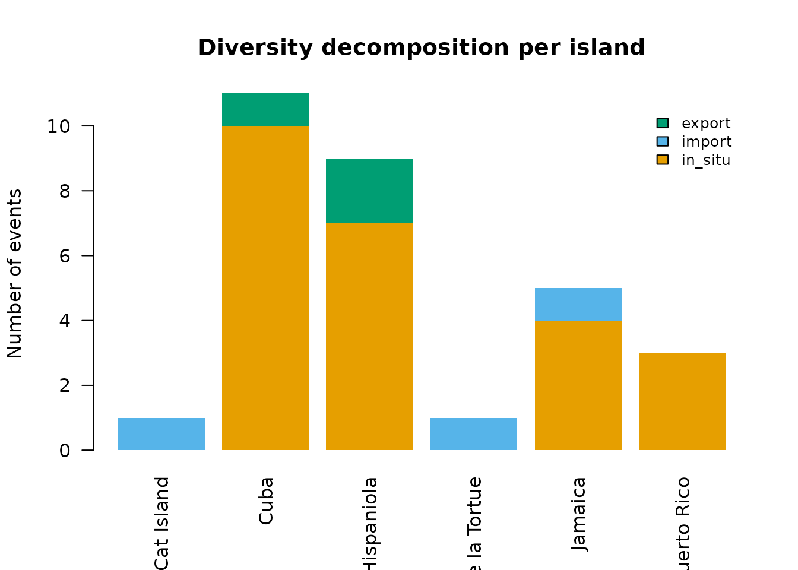
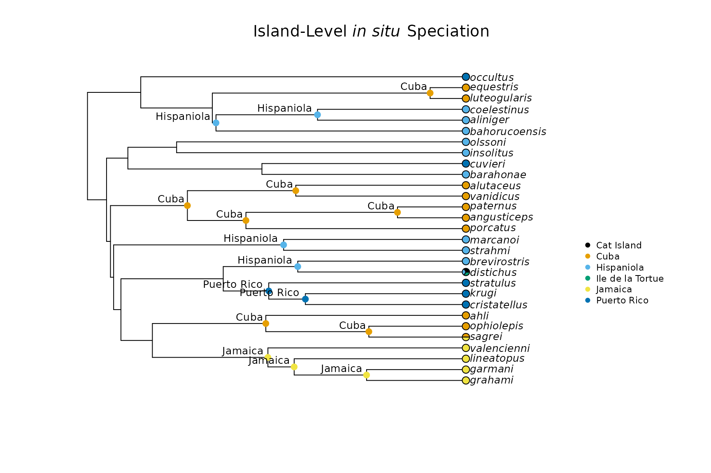

# Getting started with insitu

## Overview

The `insitu` package classifies ancestral nodes on a dated phylogeny as
in-situ speciation, colonization, or dispersal events using
distributional and phylogenetic data. It then provides functions to
partition species richness into its historical components, compute
island-specific indices, and visualize the results.

This vignette covers the core workflow from data preparation through
event classification, diversity decomposition, and island ontogeny
correction, using 30 *Anolis* lizard species from the Caribbean Islands
as a worked example.

## Data preparation

The pipeline requires a time-calibrated phylogeny and a table of species
occurrences with at least two columns: `species` and `locale`. If a
species occurs on the mainland, record its locality as `"Mainland"`.
Species must appear in both the tree and the occurrence table.

``` r

library(insitu)

tree <- ape::read.tree(
  system.file("extdata/Patton_etal_trimmed.tree", package = "insitu")
)
dat  <- read.csv(
  system.file("extdata/anolis_dat.csv", package = "insitu")
)
```

`prep_phylo` handles non-ultrametricity and stores a sampling fraction
correction that downstream rate functions use automatically. Most
empirical trees have small rounding errors that make them
non-ultrametric; this step fixes those before anything else runs.

``` r

tree <- prep_phylo(tree, force_ultrametric = TRUE, sampling_fraction = 1)
```

`match_island_phylo` prunes the tree to species in the occurrence data,
builds the presence-absence matrix (PAM), and prints a summary of what
was retained and what was dropped. Set `exclude = FALSE` to keep
mainland outgroup species in the tree for root anchoring.

``` r

matched <- match_island_phylo(phy = tree, locs = dat)
#> ℹ Species dropped from the tree because they were not in the data: transversalis and heterodermus
#> ℹ Species dropped from the data because they were not in the tree: loysiana
#> ℹ Matching complete! Here are the first 5 locales in your data:
#> # A tibble: 5 × 3
#>   locale           species_list                                         richness
#>   <chr>            <chr>                                                   <int>
#> 1 Cat Island       distichus                                                   1
#> 2 Cuba             luteogularis, equestris, alutaceus, vanidicus, porc…       10
#> 3 Hispaniola       coelestinus, aliniger, bahorucoensis, olssoni, inso…       10
#> 4 Ile de la Tortue distichus                                                   1
#> 5 Jamaica          valencienni, lineatopus, garmani, grahami, sagrei           5
```

The `matched` object is a list with three elements: `$phy` (the pruned
tree), `$PAM` (the presence-absence matrix), and `$sp_df` (a per-island
species summary). Everything downstream takes `matched$phy` and
`matched$PAM` as inputs.

## Ancestral state reconstruction

`run_geo_asr` runs a discrete-state ancestral state reconstruction for
each island in the PAM using
[`ape::ace`](https://rdrr.io/pkg/ape/man/ace.html). Each island is
treated as a distinct state alongside the mainland, so the
reconstruction estimates the probability that each ancestral node was
present on each specific island. The transition model `"ER"` assumes
equal rates between all state transitions and is the recommended
starting point for most analyses.

``` r

asr_insitu <- run_geo_asr(phy = matched$phy, PAM = matched$PAM, model = "ER")
```

The result is a named list of `ace` objects, one per island. The
`StochasticCharMapping` vignette covers `simmap_insitu` as an
alternative that propagates ASR uncertainty through stochastic character
mapping.

## Event classification

`map_insitu_events` classifies each internal node and tip based on the
ancestral reconstruction. A node is in-situ when both it and its parent
reconstruct as the same island above the probability threshold. When the
parent was on a different island the event is inter-island, and when the
parent was on the mainland the event is a colonization. The default
threshold of 0.5 is a reasonable starting point; the
`Simulating island radiations` vignette shows how to calibrate the
threshold for your own system.

``` r

map_events <- map_insitu_events(
  recons    = asr_insitu,
  phy       = matched$phy,
  PAM       = matched$PAM,
  threshold = 0.5
)

head(map_events, n = 5)
#>   node     island ancestor_presence_prob in_situ export import
#> 1   32       Cuba           0.0004768696   FALSE   <NA>   <NA>
#> 2   33 Hispaniola           0.1330833336   FALSE   <NA>   <NA>
#> 3   35    Jamaica           0.0267314591   FALSE   <NA>   <NA>
#> 4   36    Jamaica           0.9837431335    TRUE   <NA>   <NA>
#> 5   37    Jamaica           0.9977352874    TRUE   <NA>   <NA>
```

Each row corresponds to one node-island combination. The `in_situ`
column is `TRUE` when in-situ speciation was inferred. The `export` and
`import` columns record the source and destination island for each
transition, preserving the directionality of dispersal events for
downstream analysis.

## Visualization

`plot_classified_phylo` plots the phylogeny with colored nodes at
in-situ speciation events and pie charts at the tips showing each
species’ island distribution. Colors follow the Okabe-Ito palette and
are consistent across all plotting functions.

``` r

plot_classified_phylo(phy = matched$phy, events = map_events, PAM = matched$PAM)
```



## Diversity decomposition

`decompose_diversity` counts in-situ speciation, import, and export
events per island and computes the proportion of each island’s richness
that derives from in-situ speciation. Import events are cases where a
lineage arrived on an island from elsewhere; export events are cases
where a lineage left.

``` r

div <- decompose_diversity(
  phy    = matched$phy,
  events = map_events,
  PAM    = matched$PAM
)

div
#>             island n_species n_insitu n_import n_export prop_insitu
#> 1       Cat Island         1        0        1        0         0.0
#> 2             Cuba        10       10        0        1         1.0
#> 3       Hispaniola        10        7        0        2         0.7
#> 4 Ile de la Tortue         1        0        1        0         0.0
#> 5          Jamaica         5        4        1        0         0.8
#> 6      Puerto Rico         5        3        0        0         0.6
```

`plot_diversity_decomposition` shows these counts as a stacked bar
chart, making it easy to compare the relative contributions of in-situ
speciation, immigration, and emigration across islands at a glance.

``` r

plot_diversity_decomposition(div)
```



## In-situ speciation index

The in-situ speciation contribution index (ISCI) standardizes in-situ
event counts by the total branch length of each island’s subtree,
allowing comparisons across islands of different sizes and ages. A
higher ISCI means more in-situ speciation relative to the evolutionary
time represented on that island.

``` r

insitu_speciation_index(phy = matched$phy, events = map_events)
#>        island n_insitu island_bl       isci
#> 1        Cuba        7 103.02752 0.06794301
#> 2  Hispaniola        4  52.27162 0.07652336
#> 3     Jamaica        3  30.36114 0.09881053
#> 4 Puerto Rico        2  10.15259 0.19699404
```

## Node support

`insitu_confidence` extracts the per-node posterior probability of
island presence for every internal node and every island, binning each
into low (\< 0.5), moderate (0.5–0.75), or high (\>= 0.75) support. This
is useful for sensitivity analyses and for deciding whether to raise or
lower the threshold in `map_insitu_events`.

``` r

conf <- insitu_confidence(recons = asr_insitu)
head(conf, n = 15)
#>    node     island         prob support
#> 30   30 Cat Island 2.544387e-05     low
#> 31   31 Cat Island 2.446989e-08     low
#> 32   32 Cat Island 3.966199e-09     low
#> 33   33 Cat Island 1.630836e-08     low
#> 34   34 Cat Island 1.326783e-07     low
#> 35   35 Cat Island 1.543357e-06     low
#> 36   36 Cat Island 2.329244e-06     low
#> 37   37 Cat Island 1.358496e-06     low
#> 38   38 Cat Island 2.596481e-06     low
#> 39   39 Cat Island 8.563237e-06     low
#> 40   40 Cat Island 3.607820e-06     low
#> 41   41 Cat Island 1.122414e-04     low
#> 42   42 Cat Island 4.251625e-06     low
#> 43   43 Cat Island 3.806389e-06     low
#> 44   44 Cat Island 1.139486e-02     low
```

## Island ontogeny

A node classified as in-situ on an island that did not exist at the time
of that node is biologically impossible. `age_correct_events` compares
each node’s age to the formation age of the island it is assigned to and
flags events that predate the island.

Island ages for the Caribbean are approximate; the values below are
illustrative of the workflow.

``` r

ages <- c(
  Cuba             = 42,
  Hispaniola       = 50,
  Jamaica          = 25,
  "Puerto Rico"    = 46,
  "Cat Island"     = 10,
  "Ile de la Tortue" = 15
)

events_corrected <- age_correct_events(
  events           = map_events,
  phy              = matched$phy,
  island_ages      = ages,
  remove_predating = FALSE
)
#> 2 node(s) predate their island's formation age and are flagged.

# Which events predate their island?
events_corrected[events_corrected$predates_island == TRUE,
                 c("node", "island", "node_age", "island_age")]
#>   node  island node_age island_age
#> 1   32    Cuba 43.93220         42
#> 3   35 Jamaica 38.75137         25
```

Setting `remove_predating = TRUE` removes those events and returns a
cleaned table that can be passed directly to `plot_classified_phylo` or
`decompose_diversity`.

``` r

events_clean <- age_correct_events(
  events           = map_events,
  phy              = matched$phy,
  island_ages      = ages,
  remove_predating = TRUE
)
#> 2 node(s) predate their island's formation age and have been removed.

plot_classified_phylo(phy = matched$phy, events = events_clean, PAM = matched$PAM)
```



`insitu_rate_by_island_age` computes the in-situ rate using island age
as the time denominator rather than total path length, which is the
correct denominator when comparing diversification dynamics across
islands of different geological ages. This function requires the output
of `age_correct_events` as input.

``` r

insitu_rate_by_island_age(
  phy         = matched$phy,
  events      = events_corrected,
  island_ages = ages
)
#>                            island n_insitu island_age insitu_rate_corrected
#> Cuba                         Cuba        7         42            0.16666667
#> Hispaniola             Hispaniola        4         50            0.08000000
#> Jamaica                   Jamaica        3         25            0.12000000
#> Puerto Rico           Puerto Rico        2         46            0.04347826
#> Cat Island             Cat Island        0         10            0.00000000
#> Ile de la Tortue Ile de la Tortue        0         15            0.00000000
```

## Literature cited

Patton AH, Harmon LJ, del Rosario Castañeda M, Frank HK, Donihue CM,
Herrel A, Losos JB (2021) When adaptive radiations collide: Different
evolutionary trajectories between and within island and mainland lizard
clades. Proceedings of the National Academy of Sciences 118:e2024451118.

Whittaker RJ, Triantis KA, Ladie RJ (2008) A general dynamic theory of
oceanic island biogeography. Journal of Biogeography 35:977-994.
