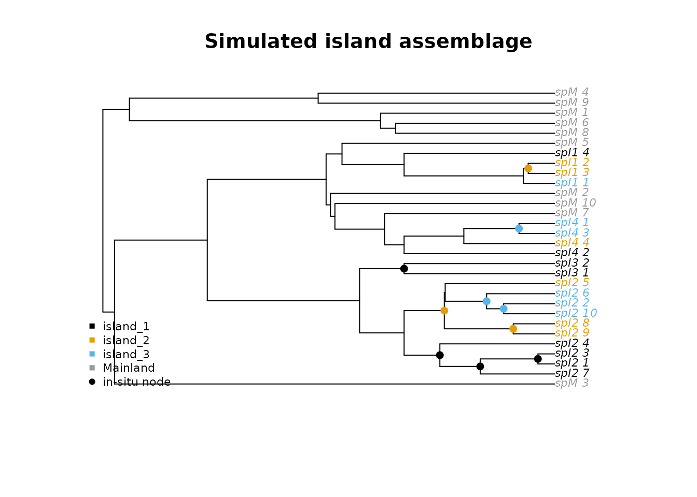

# Simulating island radiations and testing pipeline performance

## Overview

Before applying insitu to an empirical dataset, it helps to know what
level of performance to expect given the properties of your system. This
vignette shows how to simulate island radiations under known parameters,
run the full pipeline on the simulated data, and calibrate your
threshold and model choices for your own tree.

The key advantage of simulated data is that you know the ground truth.
This is, every in-situ speciation event is recorded at the time of
simulation, impliying that you can directly measure how often the
pipeline recovers them. Running this under conditions that match your
empirical system gives you a realistic F1 score to expect before you run
anything on real data.

## Simulating a single island radiation

`simulate_island` builds a mainland tree and one or more island subtrees
under separate birth-death processes, grafts them together, and forces
ultrametricity. The two colonization parameters control distinct
biological processes: `mainland_colonization_rate` governs how many
independent mainland-to-island colonization events occur (low values
give an effectively monophyletic island clade, higher values allow
polyphyletic assemblages), while `inter_island_rate` controls dispersal
between islands within the system after the initial colonization. Net
diversification and extinction fraction can differ between the mainland
and island portions of the tree, reflecting the faster radiation
typically observed on islands.

``` r

library(insitu)

sim <- simulate_island(
  n_tips                      = 30,
  diversification_rate        = 0.15,
  extinction_fraction         = 0.20,
  diversification_rate_island = 1.00,
  extinction_fraction_island  = 0.20,
  mainland_colonization_rate  = 0.05,
  inter_island_rate           = 0.50,
  n_islands                   = 3,
  n_mainland                  = 10,
  seed                        = 1
)

ape::Ntip(sim$phy)
#> [1] 30
head(sim$PAM[, 1:5])
#>     locale spM_1 spM_2 spM_3 spM_4
#> 1 island_1     0     0     0     0
#> 2 island_2     0     0     0     0
#> 3 island_3     0     0     0     0
#> 4 Mainland     1     1     1     1
nrow(sim$true_events)
#> [1] 10
```

`true_events` is the ground truth. Every row in this object is a node
the simulation placed as an in-situ speciation event, with the island it
occurred on.

``` r

plot_simulated_island(sim)
```



Tips are colored by island, grey for mainland. Filled circles mark the
true in-situ nodes from `true_events`.

## Running the pipeline on simulated data

Run the standard pipeline exactly as you would on real data. The only
difference is that you can compare the recovered events to `true_events`
afterwards.

``` r

recons <- run_geo_asr(phy = sim$phy, PAM = sim$PAM, model = "ER")

events <- map_insitu_events(
  recons    = recons,
  phy       = sim$phy,
  PAM       = sim$PAM,
  threshold = 0.75
)

# Compare recovered to true using node + island pairs
true_pairs     <- paste(sim$true_events$node, sim$true_events$island, sep = "_")
pipeline_pairs <- paste(events$node[events$in_situ == TRUE],
                        events$island[events$in_situ == TRUE], sep = "_")

tp          <- length(intersect(pipeline_pairs, true_pairs))
sensitivity <- tp / max(1L, length(true_pairs))
precision   <- tp / max(1L, length(pipeline_pairs))
f1          <- 2 * sensitivity * precision / (sensitivity + precision)

cat("Sensitivity:", round(sensitivity, 2), "\n")
#> Sensitivity: 0.9
cat("Precision:  ", round(precision,   2), "\n")
#> Precision:   0.6
cat("F1:         ", round(f1,          2), "\n")
#> F1:          0.72
```

## Power analysis across 100 replicates

A single replicate is not enough to characterize performance.
`insitu_power` runs the full simulation-and-pipeline cycle repeatedly
and returns sensitivity and precision for each replicate, so you can
compute F1 and summarize its distribution.

``` r

res <- insitu_power(
  n_sim                       = 100,
  n_tips                      = 30,
  diversification_rate        = 0.15,
  extinction_fraction         = 0.20,
  diversification_rate_island = 1.00,
  extinction_fraction_island  = 0.20,
  mainland_colonization_rate  = 0.05,
  inter_island_rate           = 0.50,
  n_islands                   = 3,
  n_mainland                  = 10,
  threshold                   = 0.75,
  model                       = "ER"
)

f1 <- 2 * res$sensitivity * res$precision /
        (res$sensitivity + res$precision)

cat("Mean F1:", round(mean(f1, na.rm = TRUE), 2), "\n")
cat("80% CI: ", round(quantile(f1, 0.10, na.rm = TRUE), 2), "-",
               round(quantile(f1, 0.90, na.rm = TRUE), 2), "\n")
```

## Calibrating for your own system

The parameters in `simulate_island` map directly onto things you can
estimate for your own dataset.

`n_tips` and `n_mainland` come from your phylogeny directly. For
`diversification_rate` and `extinction_fraction`, published estimates
for your clade are the best starting point.
`diversification_rate_island` is harder to estimate independently but
the ratio of island to mainland diversification is often available for
well-studied systems. `n_islands` is the number of distinct islands or
island-like units in your PAM. Set `mainland_colonization_rate` low
(0.01-0.05) when a single colonization origin is well established
phylogenetically and higher (0.1-0.5) when multiple independent
colonizations are likely.

Sweeping `threshold` is the most practical calibration step because it
is the one setting you control directly in `map_insitu_events`:

``` r

thresholds <- c(0.5, 0.6, 0.75, 0.9)

power_by_threshold <- do.call(rbind, lapply(thresholds, function(thr) {
  res <- insitu_power(
    n_sim                       = 100,
    n_tips                      = 30,
    diversification_rate        = 0.15,
    extinction_fraction         = 0.20,
    diversification_rate_island = 1.00,
    extinction_fraction_island  = 0.20,
    mainland_colonization_rate  = 0.05,
    inter_island_rate           = 0.50,
    n_islands                   = 3,
    n_mainland                  = 10,
    threshold                   = thr,
    model                       = "ER"
  )
  f1 <- 2 * res$sensitivity * res$precision /
            (res$sensitivity + res$precision)
  data.frame(
    threshold = thr,
    f1_mean   = mean(f1,                         na.rm = TRUE),
    f1_lo     = quantile(f1, 0.10, na.rm = TRUE),
    f1_hi     = quantile(f1, 0.90, na.rm = TRUE)
  )
}))

print(power_by_threshold)
```

``` r

plot(power_by_threshold$threshold, power_by_threshold$f1_mean,
     type  = "b",
     pch   = 19,
     ylim  = c(0, 1),
     xlab  = "Threshold",
     ylab  = "F1 score",
     main  = "Expected pipeline performance for your system")

polygon(
  c(power_by_threshold$threshold, rev(power_by_threshold$threshold)),
  c(power_by_threshold$f1_lo,     rev(power_by_threshold$f1_hi)),
  col    = adjustcolor("#0072B2", 0.2),
  border = NA
)

abline(h = 0.8, lty = 2, col = "grey70")
```

Use the threshold where F1 peaks or, if it does not reach 0.8, the
threshold that balances sensitivity and precision best for your
question. When F1 stays below 0.6 at all thresholds, your system’s
parameters (usually tree size or island-tip count) limit what the
pipeline can recover, and results should be treated as minimum bounds.
Reporting the uncertainty from `simmap_insitu` alongside point estimates
is especially important in that case.
