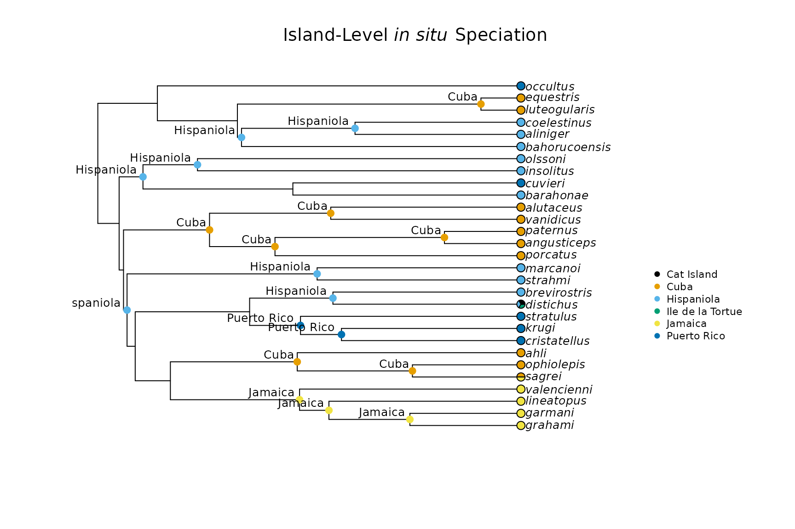

# Stochastic character mapping with insitu

## Overview

`run_geo_asr` estimates a single maximum likelihood ancestral state
reconstruction for each island. Stochastic character mapping goes
further by sampling many possible evolutionary histories consistent with
the data, giving you a posterior distribution of in-situ event
classifications rather than a single point estimate.

`simmap_insitu` wraps
[`phytools::make.simmap`](https://rdrr.io/pkg/phytools/man/make.simmap.html)
and returns the same output structure as `run_geo_asr`, so it plugs
directly into `map_insitu_events` and everything downstream without any
changes to the rest of your workflow. It also accepts a list of trees,
propagating phylogenetic uncertainty from a posterior sample alongside
ASR uncertainty from the stochastic maps.

## Setup

Load and prepare the same *Anolis* dataset used in the Getting Started
vignette. Both vignettes use the same objects, so if you are working
through them in order you can skip this step.

``` r

library(insitu)

tree <- ape::read.tree(
  system.file("extdata/Patton_etal_trimmed.tree", package = "insitu")
)
dat  <- read.csv(
  system.file("extdata/anolis_dat.csv", package = "insitu")
)

tree    <- prep_phylo(tree)
matched <- match_island_phylo(phy = tree, locs = dat)
#> ℹ Species dropped from the tree because they were not in the data: transversalis and heterodermus
#> ℹ Species dropped from the data because they were not in the tree: loysiana
#> ℹ Matching complete! Here are the first 5 locales in your data:
#> # A tibble: 5 × 3
#>   locale           species_list                                         richness
#>   <chr>            <chr>                                                   <int>
#> 1 Cat Island       distichus                                                   1
#> 2 Cuba             luteogularis, equestris, alutaceus, vanidicus, porc…       10
#> 3 Hispaniola       coelestinus, aliniger, bahorucoensis, olssoni, inso…       10
#> 4 Ile de la Tortue distichus                                                   1
#> 5 Jamaica          valencienni, lineatopus, garmani, grahami, sagrei           5
```

## Running stochastic character mapping

Pass the matched tree and PAM to `simmap_insitu` with a transition model
and the number of stochastic maps to draw. More maps give more stable
posterior averages at the cost of computation time; 100 is reasonable
for publication analyses, 10 is sufficient for exploration.

``` r

sim_results <- simmap_insitu(
  phy   = matched$phy,
  PAM   = matched$PAM,
  model = "ER",
  nsim  = 10
)
#> Running MCMC burn-in. Please wait....
#> Running 1000 generations of MCMC, sampling every 100 generations.
#> Please wait....
#> 
#> Running MCMC burn-in. Please wait....
#> Running 1000 generations of MCMC, sampling every 100 generations.
#> Please wait....
#> 
#> Running MCMC burn-in. Please wait....
#> Running 1000 generations of MCMC, sampling every 100 generations.
#> Please wait....
#> 
#> Running MCMC burn-in. Please wait....
#> Running 1000 generations of MCMC, sampling every 100 generations.
#> Please wait....
#> 
#> Running MCMC burn-in. Please wait....
#> Running 1000 generations of MCMC, sampling every 100 generations.
#> Please wait....
#> 
#> Running MCMC burn-in. Please wait....
#> Running 1000 generations of MCMC, sampling every 100 generations.
#> Please wait....
```

The result is a named list in exactly the same format as the output of
`run_geo_asr`. The probabilities at each node now reflect the average
across all stochastic maps rather than a single likelihood estimate.

## Propagating phylogenetic uncertainty

If you have a posterior sample of trees from a Bayesian analysis, pass
them as a list. `simmap_insitu` runs the stochastic maps on each tree
and averages the posteriors across both trees and maps. This is the
recommended approach for publication analyses where phylogenetic
uncertainty is non-trivial.

``` r

# trees is a multiPhylo object from a Bayesian posterior sample
sim_results_multi <- simmap_insitu(
  phy   = trees,    # list of phylo objects
  PAM   = matched$PAM,
  model = "ER",
  nsim  = 10
)
```

## Classifying events and comparing to the ML reconstruction

Event classification from `simmap_insitu` works identically to
classification from `run_geo_asr`. Pass the result directly to
`map_insitu_events`.

``` r

events_simmap <- map_insitu_events(
  recons    = sim_results,
  phy       = matched$phy,
  PAM       = matched$PAM,
  threshold = 0.5
)

head(events_simmap, n = 5)
#>   node     island ancestor_presence_prob in_situ export import
#> 1   32       Cuba                    0.0   FALSE   <NA>   <NA>
#> 2   33 Hispaniola                    0.5    TRUE   <NA>   <NA>
#> 3   35    Jamaica                    0.0   FALSE   <NA>   <NA>
#> 4   36    Jamaica                    0.9    TRUE   <NA>   <NA>
#> 5   37    Jamaica                    1.0    TRUE   <NA>   <NA>
```

Comparing the simmap classification to the ML classification from
`run_geo_asr` is a quick way to assess whether the two approaches agree.
Nodes where they disagree are candidates for closer inspection using
`insitu_confidence`.

``` r

asr_ml <- run_geo_asr(phy = matched$phy, PAM = matched$PAM, model = "ER")

events_ml <- map_insitu_events(
  recons    = asr_ml,
  phy       = matched$phy,
  PAM       = matched$PAM,
  threshold = 0.5
)

cat("In-situ events (ML):     ", sum(events_ml$in_situ    == TRUE, na.rm = TRUE), "\n")
#> In-situ events (ML):      16
cat("In-situ events (simmap): ", sum(events_simmap$in_situ == TRUE, na.rm = TRUE), "\n")
#> In-situ events (simmap):  19
```

## Visualizing the simmap classification

`plot_classified_phylo` works with either reconstruction. Nodes where
the simmap posterior probability is close to the threshold will show
visually in the same way, but a wider ribbon of support can be inspected
more directly with `insitu_confidence`.

``` r

plot_classified_phylo(phy = matched$phy, events = events_simmap, PAM = matched$PAM)
```



## Checking node-level support

`insitu_confidence` extracts the per-node per-island posterior
probabilities directly from the reconstruction object, whether from
`run_geo_asr` or `simmap_insitu`. Nodes with low support across all
islands are the ones most sensitive to threshold choice.

``` r

conf <- insitu_confidence(recons = sim_results)
#> Warning in data.frame(node = as.integer(rownames(lik)), island = island, : NAs
#> introduced by coercion
#> Warning in data.frame(node = as.integer(rownames(lik)), island = island, : NAs
#> introduced by coercion
#> Warning in data.frame(node = as.integer(rownames(lik)), island = island, : NAs
#> introduced by coercion
#> Warning in data.frame(node = as.integer(rownames(lik)), island = island, : NAs
#> introduced by coercion
#> Warning in data.frame(node = as.integer(rownames(lik)), island = island, : NAs
#> introduced by coercion
#> Warning in data.frame(node = as.integer(rownames(lik)), island = island, : NAs
#> introduced by coercion

# Nodes with high support for any island
conf[conf$support == "high", ]
#>                node           island prob support
#> distichus        NA       Cat Island  1.0    high
#> 391              39             Cuba  0.9    high
#> 401              40             Cuba  0.9    high
#> 461              46             Cuba  0.9    high
#> 471              47             Cuba  1.0    high
#> 481              48             Cuba  1.0    high
#> 491              49             Cuba  1.0    high
#> 571              57             Cuba  1.0    high
#> sagrei1          NA             Cuba  1.0    high
#> ophiolepis1      NA             Cuba  1.0    high
#> ahli1            NA             Cuba  1.0    high
#> porcatus1        NA             Cuba  1.0    high
#> angusticeps1     NA             Cuba  1.0    high
#> paternus1        NA             Cuba  1.0    high
#> vanidicus1       NA             Cuba  1.0    high
#> alutaceus1       NA             Cuba  1.0    high
#> luteogularis1    NA             Cuba  1.0    high
#> equestris1       NA             Cuba  1.0    high
#> 522              52       Hispaniola  0.8    high
#> 542              54       Hispaniola  0.9    high
#> 552              55       Hispaniola  0.9    high
#> 562              56       Hispaniola  0.8    high
#> distichus2       NA       Hispaniola  1.0    high
#> brevirostris2    NA       Hispaniola  1.0    high
#> strahmi2         NA       Hispaniola  1.0    high
#> marcanoi2        NA       Hispaniola  1.0    high
#> barahonae2       NA       Hispaniola  1.0    high
#> insolitus2       NA       Hispaniola  1.0    high
#> olssoni2         NA       Hispaniola  1.0    high
#> bahorucoensis2   NA       Hispaniola  1.0    high
#> aliniger2        NA       Hispaniola  1.0    high
#> coelestinus2     NA       Hispaniola  1.0    high
#> distichus3       NA Ile de la Tortue  1.0    high
#> 364              36          Jamaica  0.9    high
#> 374              37          Jamaica  1.0    high
#> 384              38          Jamaica  1.0    high
#> grahami4         NA          Jamaica  1.0    high
#> garmani4         NA          Jamaica  1.0    high
#> lineatopus4      NA          Jamaica  1.0    high
#> valencienni4     NA          Jamaica  1.0    high
#> sagrei4          NA          Jamaica  1.0    high
#> 425              42      Puerto Rico  0.9    high
#> 435              43      Puerto Rico  1.0    high
#> cristatellus5    NA      Puerto Rico  1.0    high
#> krugi5           NA      Puerto Rico  1.0    high
#> stratulus5       NA      Puerto Rico  1.0    high
#> cuvieri5         NA      Puerto Rico  1.0    high
#> occultus5        NA      Puerto Rico  1.0    high
```

## Downstream analysis

From this point the workflow is identical to the Getting Started
vignette. Diversity decomposition, the in-situ speciation index, and
island ontogeny correction all accept the events table from either
reconstruction approach.

``` r

div <- decompose_diversity(
  phy    = matched$phy,
  events = events_simmap,
  PAM    = matched$PAM
)

div
#>             island n_species n_insitu n_import n_export prop_insitu
#> 1       Cat Island         1        0        1        0         0.0
#> 2             Cuba        10       10        2        1         1.0
#> 3       Hispaniola        10       10        0        6         1.0
#> 4 Ile de la Tortue         1        0        1        0         0.0
#> 5          Jamaica         5        4        1        0         0.8
#> 6      Puerto Rico         5        3        2        0         0.6
```
