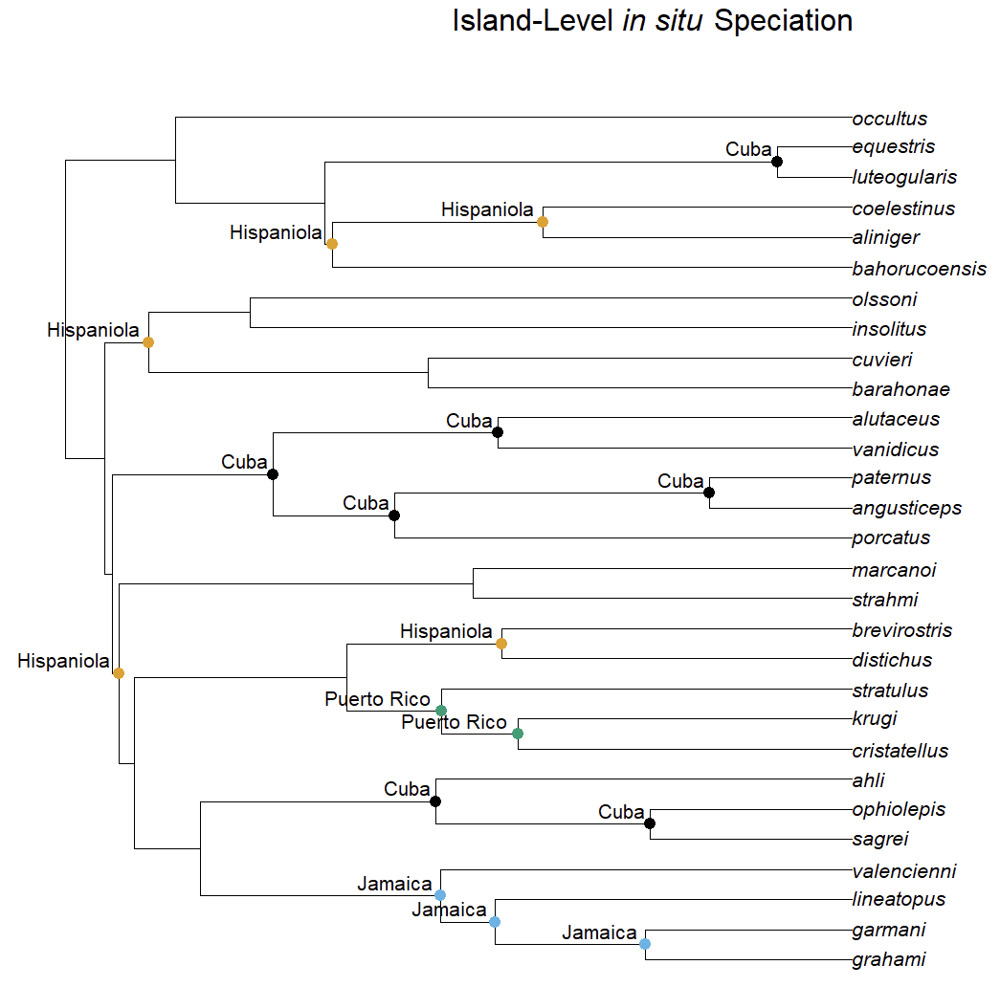

## Introduction

Stochastic character mapping is a specialization of ancestral state reconstruction (ASR) that estimates the history of character state changes across branches, instead of only at the nodes as in traditional ASR. `ape::ace()`, which is used in `insitu::run_geo_asr()`, is a traditional implementation of ASR. Stochastic character mapping provides measures of uncertainty for estimated character state changes by randomly sampling potential evolutionary histories across the phylogeny.

In this vignette, we will use stochastic character mapping to estimate the geographic history of a small sample of *Anolis* lizards native to the Caribbean Islands.

First, let's load and prepare the *Anolis* example data that we used in the Getting Started vignette.


``` r
# Load insitu library
library(insitu)

# Read in example tree
tree <- ape::read.tree(system.file("extdata/Patton_etal_trimmed.tree",
                                       package = "insitu"))

# Handle non-ultrametricity and incomplete taxon sampling
tree <- prep_phylo(tree)

# Read in example dataset
dat <- read.csv(system.file("extdata/anolis_dat.csv",
                            package = "insitu"))

# Ensure that species represented in both the tree and data are the same
matched <- match_island_phylo(phy = tree, locs = dat)
```

```
## ℹ Species dropped from the tree because they were not in the data: transversalis and heterodermus
```

```
## ℹ Species dropped from the data because they were not in the tree: loysiana
```

```
## ℹ Matching complete! Here are the first 5 locales in your data:
```

```
## # A tibble: 5 × 3
##   locale           species_list                                                                            richness
##   <chr>            <chr>                                                                                      <int>
## 1 Cat Island       distichus                                                                                      1
## 2 Cuba             luteogularis, equestris, alutaceus, vanidicus, porcatus, paternus, angusticeps, ahli, …       10
## 3 Hispaniola       coelestinus, aliniger, bahorucoensis, olssoni, insolitus, barahonae, brevirostris, dis…       10
## 4 Ile de la Tortue distichus                                                                                      1
## 5 Jamaica          valencienni, lineatopus, garmani, grahami, sagrei                                              5
```

### Stochastic Character Mapping
Next, we will run the key function for estimating the geographic history of 30 species of *Anolis* lizards that occur on the Caribbean Islands: `insitu::simmap_insitu()`. Once our data has been processed, we can use the `insitu::simmap_insitu()` function with the phylogeny and presence-absence matrix (PAM) that are returned by `insitu::match_island_phylo()`. The function also requires the user to specify a transition model and a number of simulations. The documentation for `ape::ace()` includes more information about transition models, and for this example, we will use the equal rates (ER) model. The ER model assumes that every state change has the same rate. The `insitu::simmap_insitu()` function uses the `phytools::make.simmap()` function for stochastic character mapping.


``` r
# Run simmap_insitu
sim_results <- simmap_insitu(phy = matched$phy,
                             PAM = matched$PAM,
                             model = "ER",
                             nsim = 10)
```

```
## Running MCMC burn-in. Please wait....
## Running 1000 generations of MCMC, sampling every 100 generations.
## Please wait....
## 
## Running MCMC burn-in. Please wait....
## Running 1000 generations of MCMC, sampling every 100 generations.
## Please wait....
## 
## Running MCMC burn-in. Please wait....
## Running 1000 generations of MCMC, sampling every 100 generations.
## Please wait....
## 
## Running MCMC burn-in. Please wait....
## Running 1000 generations of MCMC, sampling every 100 generations.
## Please wait....
## 
## Running MCMC burn-in. Please wait....
## Running 1000 generations of MCMC, sampling every 100 generations.
## Please wait....
## 
## Running MCMC burn-in. Please wait....
## Running 1000 generations of MCMC, sampling every 100 generations.
## Please wait....
```

The `sim_results` object includes per-island ancestral state probabilities for each node. As with the tradiational ASR approach described in the Getting Started vignette, the `sim_results` object can be used to map *in situ* speciation events and ultimately visualize those events on the phylogeny.


``` r
# Use map_insitu_events to estimate locations of in situ speciation events
events <- map_insitu_events(recons = sim_results, phy = matched$phy, PAM = matched$PAM)

# Visualize the estimated in situ speciation events on the phylogeny
plot_classified_phylo(phy = matched$phy, events = events)
```



Here, we visualize the colonization and *in situ* speciation history for 30 *Anolis* species across four islands. As discussed in the Getting Started vignette, these events can be further contextualized using several functions from `insitu`. One option is the `insitu::decompose_diversity()` function, which provides users with counts of each type of potential event (*in situ* speciation, export, and import; see the Getting Started vignette for more details).


``` r
div <- decompose_diversity(phy = matched$phy,
                           events = map_events,
                           PAM = matched$PAM)

# Look at the first 5 rows of the classification data frame
head(div, n = 5)
```

```
##             island n_species n_insitu n_import n_export prop_insitu
## 1       Cat Island         1        0        1        0         0.0
## 2             Cuba        10       10        0        1         1.0
## 3       Hispaniola        10        7        0        2         0.7
## 4 Ile de la Tortue         1        0        1        0         0.0
## 5          Jamaica         5        4        1        0         0.8
```
